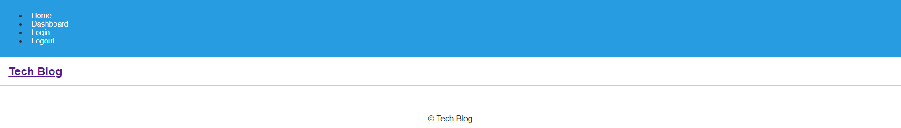

# Tech Blog

## Table of Contents

- [Description](#description)
- [Installation](#installation)
- [Usage](#usage)
- [Preview](#preview)
- [Contact](#contact)
- [License](#license)

## Description

A simple, sleek dashboard for users to create accounts and make posts and comments about tech subjects.

## Installation

[Visit the deployed site here!](https://dashboard.heroku.com/apps/ryans-tech-blog)
 
To install the app locally:

- Ensure that Node.js is installed on your local machine
- Ensure that MySql is installed on your local machine
- Clone the GitHub repo to your local machine
- Modify the ".env.EXAMPLE" file to just be named ".env", and input the MySql credentials into "DB_USER" and "DB_PASSWORD" respectively
- Use your local machine's command-line to navigate to the cloned repo's directory
- Using either MySql Workbench or the MySql shell, run the schema.sql file and then return to the normal command-line of your choice
- Run "npm install"
- Run "npm start"
- Visit http://localhost:3001/

## Usage

Upon first visiting the site, the user is greeted with a dashboard of posts. The user may visit any post they desire, and then see any additional comments under said post. If the user wishes to create posts of their own, they must first create an account. After inputting a valid username and password, the user may make posts, delete posts, make comments, and delete comments as they like. The user may log out at any time, and later login to the site again whenever they choose to.

## Preview

## Contact

- Github: [Darxmarx](https://github.com/Darxmarx)

## License

